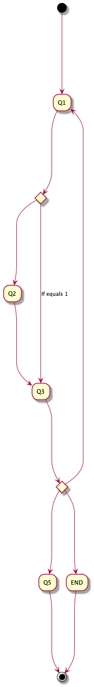

# Surveys (Beta)

Surveys is a plain java library to provide a base for nested questionnaires. It also provides a function
to [generate diagrams](#diagram-example) and to [measure answer times](#answer-duration-metrics).

[![Build][build_shield]][build_link]
[![Maintainable][maintainable_shield]][maintainable_link]
[![Coverage][coverage_shield]][coverage_link]
[![Issues][issues_shield]][issues_link]
[![Commit][commit_shield]][commit_link]
[![Dependencies][dependency_shield]][dependency_link]
[![License][license_shield]][license_link]
[![Central][central_shield]][central_link]
[![Tag][tag_shield]][tag_link]
[![Javadoc][javadoc_shield]][javadoc_link]
[![Size][size_shield]][size_shield]
![Label][label_shield]

* [Motivation](#motivation)
* [Class overview](#class-overview)
* [Diagram example](#diagram-example)
* [Usage](#usage)
    * [Define a flow](#define-a-flow)
    * [Define a flow condition](#define-a-condition)
    * [Define-a-Back-Event/Condition](#define-a-back-event-with-condition)
    * [Define custom condition](#define-custom-condition)
    * [Define custom question](#define-custom-question)
    * [Start a survey](#start-a-survey)
    * [Answer a survey](#answer-a-survey)
    * [Export a survey](#export-a-survey)
    * [Import a survey](#import-a-survey)
    * [Render a diagram](#render-a-diagram)
    * [Answer duration metrics](#answer-duration-metrics)
* [Full example](#full-example)
* [TODOs](#todos)

### Motivation

The goal of this project was to build a simple, solid core library with a minimalistic style. Means everyone can build
easily on top of it. There are no framework, no reflections, no complicated nested objects and no big dependencies (
except the diagram thingy). A survey is easy to store in a database and to modify as its just a simple ordered list.

### Class overview

There are only few classes to use

* [Survey](https://github.com/YunaBraska/surveys/blob/master/src/main/java/berlin/yuna/survey/logic/Survey.java) used to
  answer and keep the track of the history
* [SurveyDiagram](https://github.com/YunaBraska/surveys/blob/master/src/main/java/berlin/yuna/survey/logic/SurveyDiagram.java)
  renders a diagram of a survey
* [Survey](https://github.com/YunaBraska/surveys/blob/master/src/main/java/berlin/yuna/survey/model/types/QuestionGeneric.java)
  used to define a flow

### Diagram example



### Usage

#### Define a flow

```java
  Question.of("START")
        .targetGet(Question.of("Q1"))
        .targetGet(Question.of("Q2"))
        .targetGet(Question.of("Q3"))
        .targetGet(Question.of("END"));
```

#### Define a condition

```java
  QuestionBool start QuestionBool.of("START");
        start.target(Question.of("OPTION_01"),answer->answer==true);
        start.target(Question.of("OPTION_02"),new MyConditionService());
```

#### Define a back event with condition

* Back events are functions which will be triggered on any back transition which needs to step over the associated
  question
* Back conditions can block the backward transitions (Not implemented)

```java
    AtomicBoolean isBackTriggered=new AtomicBoolean(false);
        Question.of("Q1")).onBack(oldAnswer->isBackTriggered.set(true);
```

#### Define custom condition

```java
public class CustomChoice extends Choice<String> {

    //Label for diagram
    public CustomChoice() {
        super("If equals 1");
    }

    //Return true if transition to target is allwed
    @Override
    public boolean apply(final String answer) {
        return answer.equals("1");
    }
}
```

#### Define custom question

```java
import java.util.Optional;

public class MyQuestion extends QuestionGeneric<Boolean, MyQuestion> {

    //Parse answer to defined type which will be used to match a condition
    @Override
    public Optional<String> parse(final Object answer) {
        return Optional.of(Boolean.parseBoolean(answer));
    }
}

```

#### Start a survey

* Surveys are used to keep track of the answer history

```java
    Question myFlow=Question.of(Q1);
        Survey mySurvey=Survey.init(myFlow);

```

#### Answer a survey

* Surveys answer always the current question in the flow

```java
    Question myFlow=Question.of(Q1).target(Question.of(Q2));
        Survey mySurvey=Survey.init(myFlow);
        mySurvey.answer("Yes") //Answers the first question (Q1)
        mySurvey.answer("Yes") //Answers the second question (Q2)

```

#### Export a survey

* Export a survey can be useful to save the current state like to a DB

```java
        Survey mySurvey=Survey.init(Question.of(MYFLOW));
        List<HistoryItem> history=mySurvey.getHistory(); //The order is important - time is UTC

```

#### Import a survey

* Importing a survey can be useful to continue a previous survey

```java
        List<HistoryItem> history=[...]
        Survey myContinuedSurvey=Survey.init(history);

```

#### Transition backward or forward

* Transitioning back and forth won't lose the answer history

```java
        Survey survey=[...]
        survey.transitTo(Questionof("Q2"))

```

#### Answer duration metrics

* Surveys can output the time spent to answer for answering the questions

```java
        Survey survey=[...]
        survey.getDurationsMS()

```

#### Render a diagram

* A diagram can be easily rendered of any survey (default target = javaTmpDir)
* Requires the library `graphviz` e.g. `brew install graphviz`, `sudo apt-get install graphviz`

```java
        File path=SurveyDiagram.render(survey,"/optional/target/file.svg",FileFormat.SVG)
```

### Full example

```java
class SurveyExampleTest {

    @Test
    void testSurvey() {
        final QuestionBool start = QuestionBool.of("START");
        final AtomicBoolean question2BackTriggered = new AtomicBoolean(false);

        //DEFINE FLOW
        start.target(Question.of("Q1_TRUE"), answer -> answer == true);
        start.targetGet(Question.of("Q1_FALSE"), answer -> answer == false)
                .targetGet(Question.of("Q2")).onBack(oldAnswer -> question2BackTriggered.set(true))
                .targetGet(Question.of("Q3"))
                .targetGet(Question.of("END"));

        //CREATE survey that manages the history / context
        final Survey survey01 = Survey.init(start);

        //EXECUTE survey flow
        assertThat(survey01.get(), is(equalTo(QuestionBool.of("START"))));
        assertThat(survey01.answer("Yes").get(), is(equalTo(Question.of("Q1_TRUE"))));
        assertThat(survey01.transitTo("START"), is(true));

        //TRANSITION NO BACK TRIGGERED
        assertThat(question2BackTriggered.get(), is(false));
        assertThat(survey01.get(), is(equalTo(QuestionBool.of("START"))));
        assertThat(survey01.answer("No").get(), is(equalTo(Question.of("Q1_FALSE"))));

        //EXPORT / IMPORT
        List<SurveyAnswer> export = survey01.getHistory();
        final Survey survey02 = Survey.init(export);
        assertThat(export, is(equalTo(survey02.getHistory())));
        assertThat(survey02.get(), is(equalTo(Question.of("Q1_FALSE"))));
        assertThat(survey02.answer("next").get(), is(equalTo(Question.of("Q2"))));
        assertThat(survey02.answer("next").get(), is(equalTo(Question.of("Q3"))));
        assertThat(survey02.answer("next").get(), is(equalTo(Question.of("END"))));
        assertThat(survey02.answer("next").get(), is(equalTo(Question.of("END"))));
        assertThat(survey02.isEnded(), is(true));

        //TRANSITION BACK TRIGGERED
        assertThat(survey02.transitTo("START"), is(true));
        assertThat(question2BackTriggered.get(), is(true));
        assertThat(survey02.isEnded(), is(false));

        //TRANSITION FORWARD
        assertThat(survey02.transitTo("END"), is(true));
        assertThat(survey02.get(), is(Question.of("END")));
        assertThat(survey02.isEnded(), is(true));

        //IMPORT FINISHED FLOW
        assertThat(Survey.init(survey02.getHistory()).isEnded(), is(true));
    }
}
```

### TODOs
 
* [ ] Implement onBack conditions
* [ ] Implement context for conditions
* [ ] Implement groups of questions and answers?
* [ ] Export (CSV Style) / Import flows (ConditionRegister)
* [ ] Create more question examples like radio, checkbox, list, map,...
* [ ] Stop never ending circular transitions
* [ ] Implement custom exceptions
* [ ] Add diagram title and description from survey

[build_shield]: https://github.com/YunaBraska/surveys/workflows/JAVA_CI/badge.svg

[build_link]: https://github.com/YunaBraska/surveys/actions

[maintainable_shield]: https://img.shields.io/codeclimate/maintainability/YunaBraska/surveys?style=flat-square

[maintainable_link]: https://codeclimate.com/github/YunaBraska/surveys/maintainability

[coverage_shield]: https://img.shields.io/codecov/c/github/YunaBraska/surveys?style=flat-square

[coverage_link]: https://codecov.io/gh/YunaBraska/surveys?branch=master

[issues_shield]: https://img.shields.io/github/issues/YunaBraska/surveys?style=flat-square

[issues_link]: https://github.com/YunaBraska/surveys/commits/master

[commit_shield]: https://img.shields.io/github/last-commit/YunaBraska/surveys?style=flat-square

[commit_link]: https://github.com/YunaBraska/surveys/issues

[license_shield]: https://img.shields.io/github/license/YunaBraska/surveys?style=flat-square

[license_link]: https://github.com/YunaBraska/surveys/blob/master/LICENSE

[dependency_shield]: https://img.shields.io/librariesio/github/YunaBraska/surveys?style=flat-square

[dependency_link]: https://libraries.io/github/YunaBraska/surveys

[central_shield]: https://img.shields.io/maven-central/v/berlin.yuna/surveys?style=flat-square

[central_link]:https://search.maven.org/artifact/berlin.yuna/surveys

[tag_shield]: https://img.shields.io/github/v/tag/YunaBraska/surveys?style=flat-square

[tag_link]: https://github.com/YunaBraska/surveys/releases

[javadoc_shield]: https://javadoc.io/badge2/berlin.yuna/surveys/javadoc.svg?style=flat-square

[javadoc_link]: https://javadoc.io/doc/berlin.yuna/surveys

[size_shield]: https://img.shields.io/github/repo-size/YunaBraska/surveys?style=flat-square

[label_shield]: https://img.shields.io/badge/Yuna-QueenInside-blueviolet?style=flat-square

[gitter_shield]: https://img.shields.io/gitter/room/YunaBraska/surveys?style=flat-square

[gitter_link]: https://gitter.im/surveys/Lobby