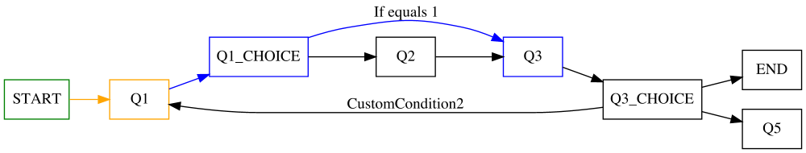

# Surveys

Surveys is a plain java library to provide a base for nested questionnaires. It also provides a function
to [generate diagrams](#diagram-example) and to [measure answer times](#answer-duration-metrics).

[![Build][build_shield]][build_link]
[![Maintainable][maintainable_shield]][maintainable_link]
[![Coverage][coverage_shield]][coverage_link]
[![Issues][issues_shield]][issues_link]
[![Commit][commit_shield]][commit_link]
[![Dependencies][dependency_shield]][dependency_link]
[![License][license_shield]][license_link]
[![Central][central_shield]][central_link]
[![Tag][tag_shield]][tag_link]
[![Javadoc][javadoc_shield]][javadoc_link]
[![Size][size_shield]][size_shield]
![Label][label_shield]

* General
    * [Motivation](#motivation)
    * [Requirements](#requirements)
    * [Diagram example](#diagram-example)
* [Question](https://github.com/YunaBraska/surveys/blob/master/src/main/java/berlin/yuna/survey/model/types/QuestionGeneric.java) usage \[Flow definition\]
    * [Define a flow](#define-a-flow)
    * [Define a flow condition](#define-a-condition)
    * [Define-a-Back-Event/Condition](#define-a-back-event-with-condition)
    * [Define custom condition](#define-custom-condition)
    * [Define custom question](#define-custom-question)
* [Survey](https://github.com/YunaBraska/surveys/blob/master/src/main/java/berlin/yuna/survey/logic/Survey.java) usage \[answers, history, transitions\]
    * [Start a survey](#start-a-survey)
    * [Answer a survey](#answer-a-survey)
    * [Export a survey](#export-a-survey)
    * [Import a survey](#import-a-survey)
* [DiagramExporter](https://github.com/YunaBraska/surveys/blob/master/src/main/java/berlin/yuna/survey/logic/DiagramExporter.java) usage \[Diagram exporter\]
    * [Render a diagram](#render-a-diagram)
    * [Diagram direction](#diagram-direction)
    * [Diagram Size](#diagram-size)
    * [Diagram Styling](#diagram-styling)
    * [Disable autogenerated choice](#disable-autogenerated-choice)
    * [Answer duration metrics](#answer-duration-metrics)
* [DiagramImporter](https://github.com/YunaBraska/surveys/blob/master/src/main/java/berlin/yuna/survey/logic/DiagramImporter.java) usage \[Diagram importer\]
    * [Import from a diagram](#import-from-a-diagram)
    * [Create a diagram manually](#create-a-diagram-manually)
* [Full example](#full-example)
* [TODOs](#todos)

### Motivation

The goal of this project was to build a simple, solid core workflow/state machine library with a minimalistic style. 
Means everyone can build easily on top of it while providing already basic functions like import/export diagrams. 
A survey is easy to store in a database and to modify as its just a simple ordered list.

### Requirements
* It's needed to install the library `graphviz` e.g. `brew install graphviz`, `sudo apt-get install graphviz` for rendering diagrams as [graphviz-java](https://github.com/nidi3/graphviz-java) is used

### Diagram example
On this example:
* Green = Answered
* Orange = Current
* Blue = Transitioned back path


#### Define a flow

```java
  Question flow = Question.of("START")
        .targetGet(Question.of("Q1"))
        .targetGet(Question.of("Q2"))
        .targetGet(Question.of("Q3"))
        .targetGet(Question.of("END"));
```

#### Define a condition

```java
  QuestionBool flow =  QuestionBool.of("START");
        start.target(Question.of("OPTION_01"),answer->answer==true);
        start.target(Question.of("OPTION_02"),new MyConditionService());
```

#### Define a back event with condition

* Back events are functions which will be triggered on any back transition which needs to step over the associated
  question
* Back conditions can block the backward transitions (Not implemented)

```java
    Question flow = Question.of("Q1").onBack(oldAnswer-> myOnBackFunction());
```

#### Define custom condition

```java
public class CustomChoice extends Choice<String> {

    //Label for diagram - nullable
    public CustomChoice() {
        super("If equals 1");
    }

    //Return true if transition to target is allowed
    @Override
    public boolean apply(final String answer) {
        return answer.equals("1");
    }
}
```

#### Define custom question

```java
import java.util.Optional;

public class MyQuestion extends QuestionGeneric<Boolean, MyQuestion> {

    //Parse answer to defined type which will be used to match a condition
    @Override
    public Optional<String> parse(final Object answer) {
        return Optional.of(Boolean.parseBoolean(answer));
    }
}

```

#### Start a survey

* Surveys are used for
  * Answering the flow
  * Tracking the answer history
  * Soring the flow config/behavior

```java
    Question flow = Question.of(START);
    Survey mySurvey = Survey.init(myFlow);

```

#### Answer a survey

* Surveys answers always the current question in the flow

```java
    Question flow = Question.of(Q1).target(Question.of(Q2));
        Survey survey = Survey.init(myFlow);
        survey.answer("Yes") //Answers the first question (Q1)
        survey.answer("Yes") //Answers the second question (Q2)

```

#### Export a survey

* Export a survey can be useful to save the current state like to a DB

```java
        Survey survey = Survey.init(Question.of(MYFLOW));
        List<HistoryItem> history = survey.getHistory(); //The order is important - time is UTC

```

#### Import a survey

* Importing a survey can be useful to continue a previous survey

```java
        List<HistoryItem> history = [...]
        Survey survey=Survey.init(history);

```

#### Transition backward or forward

* Transitioning back and forth won't lose the answer history

```java
        Survey survey = [...]
        boolean success = survey.transitTo("Q2")

```

#### Render a diagram

* A diagram can be easily rendered of any survey or flowItem (default target = javaTmpDir)

```java
    final File path=survey.diagram().save(survey, "/optional/target/file.svg", Format.SVG)
```
#### Diagram direction
* Directions (TOP_TO_BOTTOM, BOTTOM_TO_TOP, LEFT_TO_RIGHT, RIGHT_TO_LEFT)
```java
    final DiagramExporter exporter = survey.diagram();
    exporter.config().direction(LEFT_TO_RIGHT);
```
#### Diagram size
```java
     final DiagramExporter exporter = survey.diagram();
    exporter.config().width(800).height(600);
```
#### Diagram styling
* Graphviz diagram Attributes (e.g. Color, Shape,...) can additionally for each ElementType \[ITEM_DRAFT, ITEM_CHOICE, ITEM_CURRENT, ITEM_ANSWERED, ITEM_DEFAULT\]                                                
```java
    final DiagramExporter exporter = survey.diagram();
    exporter.config().add(ITEM_CURRENT, Color.RED).add(ITEM_ANSWERED, Shape.START);
```
#### Disable autogenerated choice
* Disable autogenerated choice elements
```java
    final DiagramExporter exporter = survey.diagram();
    exporter.config().add(ITEM_CHOICE, Shape.NONE);
```
#### Answer duration metrics

* Surveys can output the time spent to answer for answering the questions

```java
        Survey survey = [...]
        Map<String, Long> durations=survey.getDurationsMS()
```

#### Import from a diagram 
* Format must be [DOT](https://en.wikipedia.org/wiki/DOT_(graph_description_language))
* Import can be imported by \[File, String, InputStream, MutableGraph\]
* Its required to define possible flowItems (Child's of QuestionGeneric) and conditions (Child' of Condition) since the library doesn't use reflections yet
```java
    final QuestionGeneric<?,?> flow = new DiagramImporter().read(file)
```

#### Create a diagram manually
* Diagrams can be manually created like with [GraphvizOnline](https://dreampuf.github.io/GraphvizOnline)
* To detect the FlowItems and Conditions, it's important to add some Attributes
* Link Attributes
    * `DiagramExporter.CONFIG_KEY_SOURCE` = configures the "from" flowItem
    * `DiagramExporter.CONFIG_KEY_TARGET` = configures the "to" flowItem
* Element Attributes
    * `DiagramExporter.CONFIG_KEY_SOURCE` = Label for flowItem
    * `DiagramExporter.CONFIG_KEY_CLASS` = Class name for type of flowItem
    * `DiagramExporter.CONFIG_KEY_IGNORE` = (Optional) Used for extra not relevant flowItems like choice elements

### Full example

```java
class SurveyExampleTest {

    @Test
    void testSurvey() {
        final QuestionBool flow = QuestionBool.of("START");
        final AtomicBoolean question2BackTriggered = new AtomicBoolean(false);

        //DEFINE FLOW
        flow.target(Question.of("Q1_TRUE"), answer -> answer == true);
        flow.targetGet(Question.of("Q1_FALSE"), answer -> answer == false)
                .targetGet(Question.of("Q2")).onBack(oldAnswer -> question2BackTriggered.set(true))
                .targetGet(Question.of("Q3"))
                .targetGet(Question.of("END"));

        //CREATE survey that manages the history / context
        final Survey survey01 = Survey.init(flow);

        //EXECUTE survey flow
        assertThat(survey01.get(), is(equalTo(QuestionBool.of("START"))));
        assertThat(survey01.answer("Yes").get(), is(equalTo(Question.of("Q1_TRUE"))));
        assertThat(survey01.transitTo("START"), is(true));

        //TRANSITION NO BACK TRIGGERED
        assertThat(question2BackTriggered.get(), is(false));
        assertThat(survey01.get(), is(equalTo(QuestionBool.of("START"))));
        assertThat(survey01.answer("No").get(), is(equalTo(Question.of("Q1_FALSE"))));

        //EXPORT / IMPORT
        List<HistoryItem> export = survey01.getHistory();
        final Survey survey02 = Survey.init(flow, export);
        assertThat(export, is(equalTo(survey02.getHistory())));
        assertThat(survey02.get(), is(equalTo(survey01.get())));
        assertThat(survey02.answer("next").get(), is(equalTo(Question.of("Q2"))));
        assertThat(survey02.answer("next").get(), is(equalTo(Question.of("Q3"))));
        assertThat(survey02.answer("next").get(), is(equalTo(Question.of("END"))));
        assertThat(survey02.answer("next").get(), is(equalTo(Question.of("END"))));
        assertThat(survey02.isEnded(), is(true));

        //TRANSITION BACK TRIGGERED
        assertThat(survey02.transitTo("START"), is(true));
        assertThat(question2BackTriggered.get(), is(true));
        assertThat(survey02.isEnded(), is(false));

        //TRANSITION FORWARD
        assertThat(survey02.transitTo("END"), is(true));
        assertThat(survey02.get(), is(Question.of("END")));
        assertThat(survey02.isEnded(), is(true));

        //IMPORT FINISHED FLOW
        assertThat(Survey.init(flow, survey02.getHistory()).isEnded(), is(true));
    }
}
```

### TODOs

* [ ] Core: Implement custom exceptions
* [ ] Core: Implement onBack conditions
* [ ] Core: Fix possible circular transition on `transitTo`
* [ ] Feature: Survey config `autoBack=[true/false]`
* [ ] Feature: Implement context for conditions
* [ ] Feature: Add More question examples like radio, checkbox, list, map,...
* [ ] Feature: Implement groups of questions and answers?
* [ ] Diagram: Generate heat map from List of Surveys for e.g. most, longest, never taken answers
* [ ] Diagram: Show possible back transitions
* [ ] Diagram: Import / Export from UML
* [ ] Diagram: Import without attributes configurable by element type? && somehow configurable conditions by link label? 

[build_shield]: https://github.com/YunaBraska/surveys/workflows/JAVA_CI/badge.svg
[build_link]: https://github.com/YunaBraska/surveys/actions?query=workflow%3AJAVA_CI
[maintainable_shield]: https://img.shields.io/codeclimate/maintainability/YunaBraska/surveys?style=flat-square
[maintainable_link]: https://codeclimate.com/github/YunaBraska/surveys/maintainability
[coverage_shield]: https://img.shields.io/codeclimate/coverage/YunaBraska/surveys?style=flat-square
[coverage_link]: https://codeclimate.com/github/YunaBraska/surveys/test_coverage
[issues_shield]: https://img.shields.io/github/issues/YunaBraska/surveys?style=flat-square
[issues_link]: https://github.com/YunaBraska/surveys/commits/master
[commit_shield]: https://img.shields.io/github/last-commit/YunaBraska/surveys?style=flat-square
[commit_link]: https://github.com/YunaBraska/surveys/issues
[license_shield]: https://img.shields.io/github/license/YunaBraska/surveys?style=flat-square
[license_link]: https://github.com/YunaBraska/surveys/blob/master/LICENSE
[dependency_shield]: https://img.shields.io/librariesio/github/YunaBraska/surveys?style=flat-square
[dependency_link]: https://libraries.io/github/YunaBraska/surveys
[central_shield]: https://img.shields.io/maven-central/v/berlin.yuna/surveys?style=flat-square
[central_link]:https://search.maven.org/artifact/berlin.yuna/surveys
[tag_shield]: https://img.shields.io/github/v/tag/YunaBraska/surveys?style=flat-square
[tag_link]: https://github.com/YunaBraska/surveys/releases
[javadoc_shield]: https://javadoc.io/badge2/berlin.yuna/surveys/javadoc.svg?style=flat-square
[javadoc_link]: https://javadoc.io/doc/berlin.yuna/surveys
[size_shield]: https://img.shields.io/github/repo-size/YunaBraska/surveys?style=flat-square
[label_shield]: https://img.shields.io/badge/Yuna-QueenInside-blueviolet?style=flat-square
[gitter_shield]: https://img.shields.io/gitter/room/YunaBraska/surveys?style=flat-square
[gitter_link]: https://gitter.im/surveys/Lobby